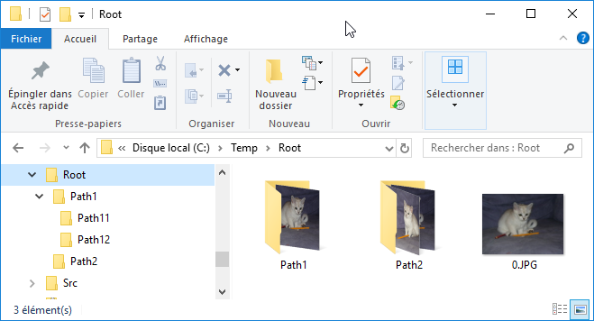
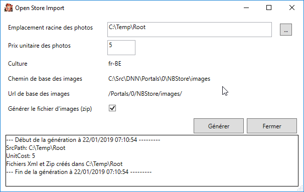
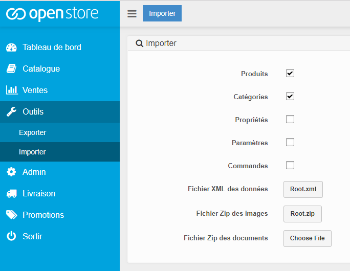
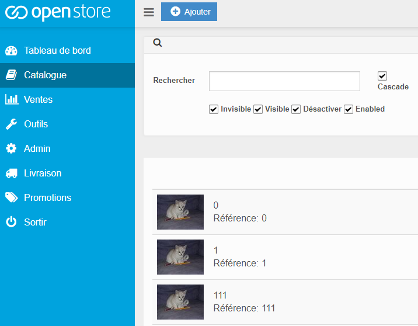
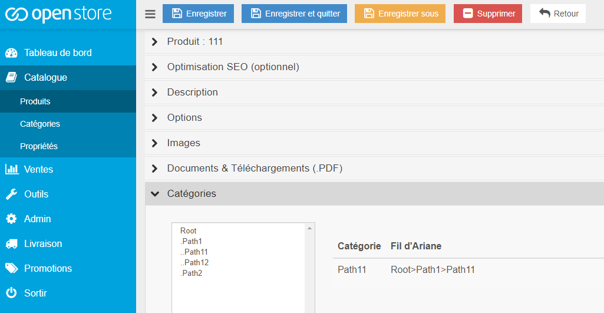

# OpenStoreImport User guide
## What is this tool for?
The OpenStore backoffice allows to import products and categories into the store.
To achieve that, an import file containing XML must be provided (uploaded), this file must contain the products and categories information described using a valid XML format.
If you want to use the backoffice import function it is usually because you have a lot of product and categories to import;
if you only have some products, why using the import function instead of the regular UI?

This tool therefore provides you a convenient way to generated the import XML file from a common folder and file structure, 
it also generates the zip file containing the product pictures.
This tool doesn't upload the file to the OpenStore backoffice.

## File and folder structure
Let’s say you’ve a root folder – called ‘Root’ – containing subfolders and pictures:

The root folder name will be used as the name of the root category when imported in the store.
The subfolders will be used as the name of subcategories in the store.
The pictures will be used as product in the store. The picture filename is used as the product and model name, the picture is used as the image of the product.
## The import tool
Start the import tool:

Fill or select the root folder, and click “Generate”
Two files are generated:
* Root.xml: The Open Store import file containing the definitions of all the categories and products
* Root.zip: a zip file containing all the pictures
## Open Store import
Import those two files using the Open Store Import module:

All the Products are created, for instance here the pictures 0.jpg, 1.jpg, 111.jpg:

And are associated with their corresponding category, for instance the picture 111 from the subfolder Path11:

